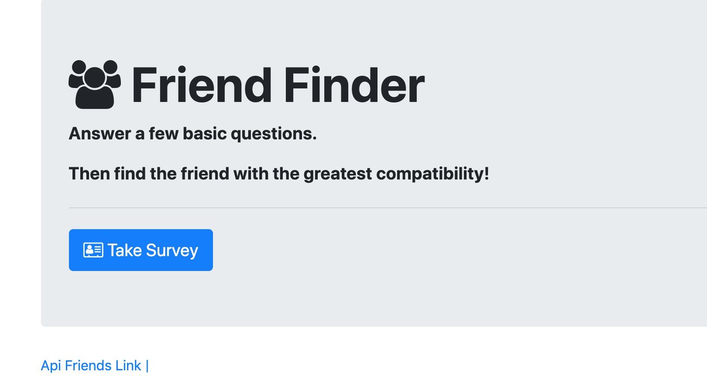

# Friend-Finder

Licensing Information: READ LICENSE
---
Project source can be downloaded from https://github.com/lordpaulthomas/Friendly-Finder
----
Author
-----------
Paul Thomas

File List
---------
```
.:

LICENSE

Letter.js

README.md

friends.js

home.html

survey.html

api.Routes.js

htmlRoutes.js

server.js

.gitignore

.:
```

Description of Friend Finder
------------------------------
Friend finder is an application that connects people by compatibility.  Users are prompted to fill out a survey, then they are shown who their best match is based on the answers given to the survey.  The current user is then added to the database and is a now a potential match for the next user.  

Given that this app is not actually attached to a database, whenever the page is
closed, the recently added users will not persist.


Link to Heroku Deployment of App
----------------------
https://pt-friendfinder.herokuapp.com/


**Clone Instructions
----------

- To run on localally you must first download `Node.js`
- From a CLI, navigate to where you git cloned.
- Use the command `npm init -y` to create package.json
- Use the command `npm i express body-parser` to require the necessary modules
- Use the command `node server.js` to start server (_app listening on PORT 3000_ should appear in CLI)
- Open a web browser and go to `https://localhost:3000`
- From this page you can interact with the app locally

Screen Shot
---------

